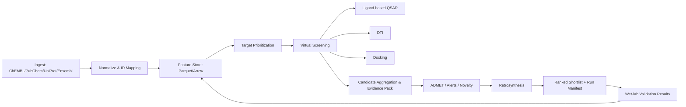
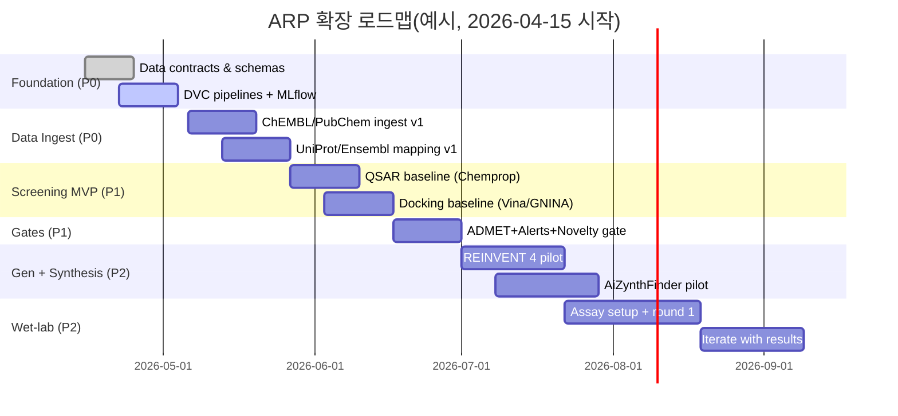

# ARP 파이프라인을 ‘Novel Drug Candidate 발굴’용으로 확장하기 위한 실행형 로드맵

## Executive summary
현재 arp-v21은 **Research Prototype / Demo Only**로 명시되어 있고, 핵심 모듈(예: latent diffusion, TFBindFormer)은 “mock only/실모델 부재”, 여러 통합은 “API keys 필요/네트워크 의존” 상태라 **신뢰 가능한 후보물질 발굴 파이프라인으로 바로 쓰기 어렵습니다.** citeturn4view0turn6view0turn6view3  
이를 “novel drug candidate 발굴” 용도로 확장하려면, 모델 성능보다 먼저 **데이터 계약(data contract)·데이터 버전·재현성·모듈 경계·출력 신뢰성(감사가능성)**을 제품 수준으로 끌어올리고(Foundation), 그 위에 공개 DB 기반의 **타깃 우선순위화 → Hit 탐색(리간드 기반 + 구조 기반) → Lead 최적화(생성/다목적 최적화) → ADMET/합성가능성 필터**를 단계적으로 얹는 전략이 가장 실행 가능성이 높습니다. citeturn16search0turn14search6turn14search3turn11search20turn11search3  
권장 MVP는 “질병 1개/타깃 1–2개/화합물 라이브러리 10만–100만 개” 범위에서 **재현 가능한 스크리닝과 근거(evidence) 추적이 되는 랭킹 결과**를 내고, 상위 후보에 대해 **도킹/ADMET/합성가능성까지 1차 적합성**을 제공하는 형태입니다(6–10주). citeturn13search2turn1search5turn10search4turn12search4  

## 현황 진단과 목표 상태 정의
### 현재 arp-v21의 위치
- arp-v21의 README는 “Research Prototype / Demo Only”, “NOT production ready”, “Mock Only/Heuristic” 등을 명시하고, DB 통합은 “Not Working/API keys required”, 실모델은 “missing”으로 적고 있습니다. citeturn4view0turn6view0  
- 오케스트레이터는 `manifest.json`에 seed, git commit, python version 등 메타데이터를 기록하려는 구조가 있고, mock 모드에서 “deterministic heuristic/curated”임을 보고서에 표기하도록 되어 있습니다. 이 “실행 메타데이터 기록”은 제품화 시 아주 좋은 출발점입니다. citeturn6view0turn6view2  

### 목표 상태
“novel drug candidate 발굴”을 위해 필요한 목표 상태를 **기술적 산출물 기준**으로 정리하면 다음과 같습니다.

- **출력 신뢰성(감사/재현 가능)**: 같은 코드+같은 데이터 스냅샷+같은 설정이면 동일 결과(혹은 허용 오차 범위 내) 재현, 모든 결과에 provenance(데이터/모델/파라미터/환경)가 포함. (FAIR 원칙의 “재사용 가능성/기계 가독성” 방향과 부합) citeturn16search0turn14search6  
- **모듈 경계/계약**: 각 단계는 (입력 스키마, 출력 스키마, 실패 모드, 성능/품질 지표)를 명확히 분리하고, 단계 간 데이터는 표준 포맷(예: Parquet/Arrow, JSONL)으로 교환. citeturn14search4turn14search1  
- **데이터 합법성/라이선스 준수**: ChEMBL은 CC BY-SA 3.0이므로 “변형/재배포” 시 share-alike 의무가 생길 수 있고, UniProt/AlphaFold/PDB/Open Targets 등은 비교적 개방적이지만 각 약관/라이선스를 파이프라인 설계에 반영해야 합니다. citeturn16search1turn0search11turn1search5turn13search10turn9search0  

## 우선순위 기반 요구사항과 산출물
아래 표는 “제품화에 가장 큰 리스크를 만드는 항목(데이터/재현성/모듈 경계/출력 신뢰성)”에 가중치를 두고 우선순위를 매긴 것입니다.

| 우선순위 | 요구사항 | “완료” 판정 기준 | 1차 산출물 |
|---|---|---|---|
| P0 | 데이터 계약(스키마) + 결과 provenance | 모든 단계 출력이 스키마 검증을 통과하고, run 단위로 데이터/모델/환경/파라미터가 식별됨 | `schemas/`(JSON Schema), `manifest.json`, `run_id` 체계 citeturn6view2turn14search6 |
| P0 | 데이터 버전/실험 추적 | 데이터 스냅샷/전처리/모델/메트릭이 한 커밋(혹은 run)에서 재현됨 | DVC 파이프라인/remote, MLflow 실험/모델 레지스트리 citeturn14search6turn14search2turn14search3 |
| P0 | 모듈 경계(플러그인) + 에러 모델 | 모듈 실패가 파이프라인 전체를 “침묵 오류”로 만들지 않고, 실패 원인이 결과에 기록됨 | `arp modules` 구조, 표준 에러 코드, “partial results” 정책 |
| P1 | 공개 DB 기반 “Hit 탐색” 엔진 | (리간드 기반) + (도킹) + (DTI) 중 2개 이상이 재현가능하게 동작 | RDKit 표준화/필터, Vina/GNINA/DiffDock, DeepPurpose/Chemprop 연동 citeturn1search7turn11search3turn11search2turn11search1turn12search21turn10search4 |
| P1 | ADMET/안전성 1차 필터 | 최소 독성/용해도/대사안정성/PAINS 등 “빨간불” 후보 제거 | MoleculeNet 기반 모델 + RDKit 필터 카탈로그(PAINS 등) citeturn10search1turn17search1turn17search8 |
| P2 | 생성(De novo) + 합성가능성 | 다목적 최적화로 신규 후보 생성, 합성 경로/구매 가능성 평가 가능 | REINVENT 4 + AiZynthFinder/ASKCOS 연동 citeturn11search20turn12search4turn12search1 |
| P2 | 실험 검증 루프 자동화 | 실험 결과가 다시 학습/랭킹에 반영(Active learning) | Assay 결과 ingestion + 재학습 워크플로 |

## 데이터 소스 전략과 거버넌스
### 데이터 소스 표
사용자 요청의 “공식 데이터베이스 우선” 원칙을 최상단에 두고, 실제 후보 발굴에 필요한 보완 소스를 우선순위로 정리했습니다(라이선스·접근·포맷 포함).

| 우선순위 | 소스 | 목적(파이프라인 단계) | 접근 방법 | 라이선스/약관 핵심 | 주요 포맷 |
|---|---|---|---|---|---|
| P0 | ChEMBL | bioactivity(QSAR/DTI), known actives, target 매핑 | Web/REST/다운로드 | CC BY‑SA 3.0(재배포 시 share‑alike 고려) citeturn16search1turn16search9turn0search9 | TSV/SQL dump/REST(JSON 등) citeturn0search0turn0search9 |
| P0 | PubChem | 구조/동의어/ID 매핑, 대규모 구조 라이브러리 | Downloads, PUG‑REST | entity["organization","NLM","us national library of medicine"]의 정부 제작 콘텐츠는 원칙적으로 public domain(적절한 acknowledgment 요청) citeturn16search2turn0search1turn0search13 | SDF/JSON/XML 등 citeturn0search16turn0search1 |
| P0 | UniProt | 타깃 단백질 서열/기능/주석 | API/다운로드 | CC BY 4.0 citeturn0search11turn0search5turn16search7 | TSV/JSON/XML/RDF/FASTA citeturn16search7turn0search2 |
| P0 | Ensembl | 유전자/전사체/변이 주석, ID 매핑 | FTP/REST | 데이터는 entity["organization","EMBL-EBI","bioinformatics institute uk"] Terms of Use, 소프트웨어는 Apache 2.0 citeturn1search9turn1search3turn1search0 | FASTA/JSON/VCF 등 citeturn1search12turn1search18 |
| P1 | entity["organization","Open Targets","target validation consortium"] Platform | 타깃-질병 근거 증거(evidence) 통합 | GraphQL/다운로드 | 데이터 CC0 1.0(공개 도메인 헌납) citeturn9search0turn9search24turn9search16 | JSON/TSV citeturn9search4turn9search24 |
| P1 | GWAS Catalog | 질병 연관 유전 근거(GWAS) | REST/FTP | (시각화 등) CC BY 4.0 및 리소스 인용 권고 citeturn9search7turn9search11turn9search23 | TSV/RDF/summary stats 원본 citeturn9search11turn9search23 |
| P1 | entity["organization","RCSB PDB","protein data bank us"] / entity["organization","wwPDB","protein data bank consortium"] | 실험 구조(도킹/포켓 분석/검증) | Batch/API | PDB 아카이브 CC0 1.0(공개 도메인) citeturn13search2turn13search10 | mmCIF/BinaryCIF/PDB citeturn13search3turn13search11 |
| P1 | AlphaFold DB | 실험 구조 부재 타깃의 구조 대체(도킹) | 다운로드/GCP public dataset | CC BY 4.0, 전체 데이터셋 규모가 매우 큼(수십 TiB 단위) citeturn1search5turn1search14 | PDB/mmCIF, 메타데이터 |
| P1 | entity["organization","Broad Institute","cambridge ma us"] LINCS L1000 | 전사체 시그니처 기반 MoA/phenotype 연결 | GEO/CLUE, S3 등 | LINCS 데이터는 attribution 요구, 커뮤니티 문서에서는 CC‑BY로 배포 언급 citeturn9search1turn9search9turn9search5 | GCT/GCTx 등 citeturn9search21turn9search1 |
| P2 | SureChEMBL(특허) | novelty/patent‑aware 필터링 | 파일/DB | CC BY‑SA 3.0 citeturn0search24turn16search1 | 텍스트/화합물 어노테이션 |

### 접근·정합성·라이선스 리스크를 줄이는 데이터 설계 원칙
- **ID 정규화의 중심키를 InChIKey + Canonical SMILES로 이중화**: PubChem CID, ChEMBL ID, vendor ID 등은 변동/중복이 발생할 수 있어(동일 구조의 다중 레코드) 내부 “canonical compound id”를 별도로 두는 것이 안전합니다(형식 예시는 아래 MVP 스펙에 포함). PubChem은 다운로드/프로그램 접근(PUG‑REST)을 공식 제공하므로 대량 파이프라인에 적합합니다. citeturn0search1turn0search13turn0search16  
- **ChEMBL(CC BY‑SA)로부터 파생된 “학습/전처리 결과물”의 배포 전략을 사전에 결정**: 내부 연구용으로만 사용해도 괜찮지만, 만약 파생 데이터를 외부에 제공(예: SaaS 결과 다운로드)하면 share‑alike 충돌 가능성이 생깁니다(법무 검토 권장). citeturn16search1turn16search21  
- **대규모 구조/시그니처 데이터는 ‘원본은 오브젝트 스토리지, 피처는 Parquet’**: Parquet은 컬럼 지향 포맷으로 대규모 분석/필터링에 유리하고, Arrow는 표준화된 인메모리 컬럼 포맷으로 파이썬/스파크/폴라스 등과 잘 맞습니다. citeturn14search4turn14search1  
- **FAIR 원칙을 “기계 가독 provenance”로 구현**: 데이터·모델·워크플로가 함께 재사용 가능해야 한다는 FAIR의 취지를, run manifest/스키마/버전 고정으로 실무에 녹입니다. citeturn16search0turn6view2turn14search6  

## 모델·알고리즘·평가 체계
아래 표는 “단계별 문제 설정 → 권장 모델/기법 → 오픈소스 구현 → 하이퍼파라미터(권장 초기값) → 평가 지표”를 **바로 실험 설계 가능한 수준**으로 정리한 것입니다.

### 모델·알고리즘 표
| 단계 | 핵심 과제 | 권장 기법/모델 | 오픈소스 구현(예) | 권장 초기 하이퍼파라미터(예시) | 평가 지표/검증 |
|---|---|---|---|---|---|
| 화합물 표준화/필터 | 중복/염/정규화, “나쁜 화합물” 1차 제거 | RDKit 표준화 + PAINS/Alert 필터 | entity["organization","RDKit","open-source chem toolkit"] FilterCatalog(PAINS 등) citeturn17search1turn17search5turn1search1 | 표준화 규칙(염 제거, tautomer 정책) 고정; PAINS A/B/C 모두 표시 | Validity(파싱 성공률), 제거율, “경고 사유” 기록 citeturn17search8turn17search4 |
| 타깃 우선순위화 | 후보 타깃을 “근거 기반”으로 랭킹 | 지식근거 통합(스코어링) + 네트워크 기반 확산(선택) | Open Targets evidence + GWAS Catalog 보강 citeturn9search16turn9search0turn9search11 | evidence 가중치(유전>임상>전사체 등) 정책을 YAML로 관리 | Precision@K(후속 검증 타깃), evidence coverage, 재현성 |
| 리간드 기반 Hit 탐색 | known actives 근처에서 hit 찾기(확률↑) | 유사도(ECFP+Tanimoto) + QSAR(MPNN) | Chemprop(D‑MPNN) citeturn10search4turn10search0 | depth 4–6, hidden 300, dropout 0.1, epochs 50–100(early stopping) *(초기값, 데이터에 따라 조정)* | AUROC/PR‑AUC(분류), RMSE/MAE(회귀), scaffold split 성능 citeturn10search5turn10search9 |
| DTI(약물‑타깃) 예측 | 신규 타깃/저데이터 타깃에서 hit 확대 | 멀티‑인코더 DTI, (SMILES+서열) | DeepPurpose citeturn12search21turn12search2 / DeepDTA(베이스라인) citeturn12search22turn12search3 | encoder 조합(예: Morgan/Transformer + CNN)부터 시작, negative sampling 정책 명시 | AUROC/PR‑AUC, calibration(ECE), 외부셋(타깃 홀드아웃) |
| 구조 기반(도킹) | 포즈 생성 + 스코어링으로 false‑positive 줄이기 | (빠른) Vina + (딥스코어) GNINA + (포즈생성) DiffDock | AutoDock Vina citeturn11search3turn11search15 / GNINA citeturn11search2turn11search22 / DiffDock(-L 포함) citeturn11search1 | Vina exhaustiveness 8–16, n_poses 10; GNINA 기본 CNN+Vina; DiffDock 기본 weight, confidence threshold 운영 | Pose RMSD(검증용), Enrichment Factor, BEDROC; 도킹‑QSAR 합의(consensus) |
| 생성/최적화(Lead) | 다목적(효능+ADMET+novelty+합성) 최적화 | RL 기반 de novo + 다중 스코어 | REINVENT 4 citeturn11search20turn11search0 | scoring components: potency(QSAR), docking, logP/PSA, SA score, novelty; RL step size/learning rate는 레퍼런스 설정에서 출발 | Validity/Uniqueness/Novelty, property satisfaction, top‑k hit quality |
| ADMET/독성 1차 필터 | “잘못된 후보”를 싸게 제거 | 멀티태스크 QSAR + 구조 알럿 | MoleculeNet 기반 학습 citeturn10search1turn10search5 + RDKit alert | task imbalance 대응(class weight/focal), threshold calibration | AUROC/PR‑AUC(독성), RMSE(용해도), false negative 관리 |
| 합성가능성 | 실험 가능한 물질로 수렴 | retrosynthesis(MCTS) | AiZynthFinder citeturn12search4turn12search0 / ASKCOS citeturn12search1turn12search5 | max depth 4–6, max routes N, precursor catalog(구매가능) 구성 | route length, success rate, estimated cost/availability |

### 평가 설계에서 흔히 무너지는 지점과 권장 방지책
- **데이터 split**: 화합물 데이터는 랜덤 split이 과대평가를 만들 수 있으므로(동일 scaffold가 train/test에 섞임) **scaffold split**을 기본으로 두고, “타깃 홀드아웃(새 타깃)” 평가도 별도로 둡니다. MoleculeNet은 다양한 split/메트릭을 제시합니다. citeturn10search9turn10search5  
- **스크리닝 품질 지표**: in vitro HTS/중간처리에서는 Z‑factor(Z’)가 품질 지표로 널리 쓰이며, Z’>0.5가 흔한 기준으로 언급됩니다(단, 복잡한 phenotype assay는 완화 가능). citeturn13search12turn13search5turn13search1  
- **PAINS/구조 알럿**: PAINS 필터는 “완전한 금지”가 아니라 **flagging** 후 후속 실험/정밀 assay에서 확인하는 방식이 더 현실적입니다. RDKit는 FilterCatalog로 PAINS 등 필터링을 지원합니다. citeturn17search4turn17search1turn17search8  

## 인프라·배포·재현성 설계
### 권장 아키텍처
핵심은 “데이터와 모델의 버전이 제품 기능의 일부”가 되도록 만드는 것입니다. DVC는 데이터/파이프라인을 버전 관리하고 파라미터화된 실험 실행을 지원하며, MLflow는 실험/모델 레지스트리로 모델 라이프사이클 관리를 돕습니다. citeturn14search6turn14search2turn14search3  

아키텍처 플로우(권장 모듈 경계):



이 구조는 “후속 실험 결과가 다시 피처/모델에 반영되는 루프”를 명시합니다(Active learning은 P2에서 확장).  

### 인프라 명세 표
| 영역 | 권장 선택지 | MVP 권장 스펙 | 확장(프로덕션/대규모) | 근거/주의 |
|---|---|---|---|---|
| 컴퓨트 | CPU(대량 전처리) + GPU(도킹/생성/딥러닝) | CPU 32–64 vCPU, RAM 128–256GB, GPU 1–2장(24GB+) | GPU 4–8장 노드 + 스케줄러(K8s/Ray/Slurm) | DiffDock/GNINA/생성 모델은 GPU 이점이 큼 citeturn11search1turn11search2turn11search20 |
| 스토리지 | 오브젝트 스토리지 + 컬럼 포맷 | Raw(다운로드) + Parquet(피처/결과) | Data lake(버전/카탈로그) + 캐시 | Parquet/Arrow는 대규모 분석 친화 citeturn14search4turn14search1 |
| 실험 추적 | 실험/모델 메타 저장 | MLflow 서버(backend DB 포함) | Model Registry/승인 워크플로 | MLflow registry는 모델 lineage/version/alias 제공 citeturn14search3turn14search7 |
| 데이터 버전 | 데이터 스냅샷/라인리지 | DVC + remote(S3 등) | 멀티리모트/권한분리 | 재현 가능한 pipeline 관리 citeturn14search6turn14search2 |
| CI/CD | 테스트/빌드/배포 자동화 | lint+unit+schema test | 모델 평가 게이트(성능 하락 차단) | “출력 신뢰성”을 CI에서 강제 |
| 보안 | 비밀키/접근통제 | secrets는 env/secret store | RBAC, 감사로그, key rotation | “API keys required” 구조를 안전하게 관리 citeturn4view0turn6view0 |
| 구조 데이터 | PDB/AlphaFold | 필요 타깃만 부분 다운로드 | 캐시/프록시/사전 필터 | PDB CC0, AlphaFold CC BY 4.0; AlphaFold 전체는 매우 큼 citeturn13search10turn1search14turn1search5 |

### 재현성 “필수 구현” 체크리스트
(최소 bullets로, 실행 가능 체크리스트 형태)
- **Run Manifest 표준화**: `run_id`, git commit, python env(패키지 freeze), 데이터 스냅샷 해시(DVC), 모델 체크포인트 해시, 파라미터 파일 경로를 반드시 포함. arp-v21의 manifest 아이디어를 확장합니다. citeturn6view0turn6view2turn14search6  
- **스키마 검증을 파이프라인 게이트로**: 각 모듈 출력(JSON/Parquet)을 JSON Schema/Pydantic 등으로 검증하고 실패 시 “실패 원인+입력 요약+재현 정보”를 기록.  
- **Determinism 정책 명시**: 도킹/딥러닝/샘플링은 완전 결정론이 어려울 수 있으므로(연산/라이브러리/하드웨어 영향), “결정론 보장 수준(완전/부분/비결정)”을 모듈 메타데이터로 내려보냄. (arp-v21도 mock는 deterministic이라고 표기) citeturn6view0turn4view0  
- **데이터·모델 라이선스 메타**: 데이터 소스/버전/라이선스를 결과에 포함(FAIR + 컴플라이언스). citeturn16search0turn16search1turn0search11turn13search10turn9search0  

## 구현 단계 로드맵과 실행 체크리스트
### 단계별 계획, 기간, 우선순위, 산출물
아래는 “바로 실행 가능한 작업 단위”로 쪼갠 로드맵입니다(기간은 2026년 기준의 **경험적 범위 추정**이며, 내부 인력 숙련도/데이터 규모에 따라 변동).

| 단계 | 기간(예상) | 우선순위 | 목표 | 핵심 산출물 |
|---|---:|---|---|---|
| Foundation | 2–3주 | P0 | 데이터 계약/버전/재현성/모듈 경계 | 스키마, DVC 파이프라인, MLflow 기본, 표준 manifest |
| Data Ingest v1 | 2–4주 | P0 | ChEMBL/PubChem/UniProt/Ensembl 최소 ingestion | 정규화 테이블(Parquet), ID mapping, QA 리포트 |
| Screening MVP | 3–5주 | P1 | QSAR + 도킹(또는 DTI) 2축 스크리닝 | ranked shortlist + evidence pack |
| ADMET+Novelty Gate | 2–3주 | P1 | PAINS/알럿/ADMET 1차 필터 및 novelty | “fail reason” 포함 필터 결과 |
| Generative v1 | 4–6주 | P2 | 생성+다목적 최적화 | REINVENT 4 파이프라인 + scoring function |
| Synthesis + วet-lab Loop | 6–10주 | P2 | 합성가능성/구매가능성 + 실험 결과 회수 | AiZynthFinder/ASKCOS 연동 + assay ingestion |
| Productionization | 4–8주 | P1–P2 | 배포/모니터링/권한/감사 | CI/CD 게이트, 대시보드, 운영 정책 |

### mermaid 타임라인(권장)


### Foundation 단계 체크리스트(P0)
- **스키마/데이터 계약**: `Target`, `Compound`, `Assay`, `CandidateScore`, `EvidenceItem` 등 최소 5개 스키마(JSON Schema) 정의 → CI에서 스키마 검증 필수.  
- **DVC로 데이터 스냅샷 고정**: “원본 다운로드 → 전처리 → 피처 생성 → 학습 → 평가”를 stage로 분리하고, `dvc.yaml`로 lineage를 남김. DVC는 파이프라인/실험 실행을 공식 문서로 지원합니다. citeturn14search6turn14search2turn14search10  
- **MLflow 추적 도입**: 최소한 run별 params/metrics/artifacts(모델, 리포트) 저장. Model Registry를 쓰면 모델 버전/alias/lineage 관리가 쉬워집니다. citeturn14search3  
- **라이선스 메타 자동 삽입**: 데이터 소스별 (버전, 라이선스, 접근일) metadata를 결과 manifest에 주입. ChEMBL CC BY‑SA, UniProt CC BY 4.0, PDB CC0, AlphaFold CC BY 4.0, Open Targets CC0 등은 소스가 명확합니다. citeturn16search1turn0search11turn13search10turn1search5turn9search0  

## 실험 검증 계획
### 검증 철학
계산 파이프라인은 “가설 생성기”이므로, **가장 저렴한 실험부터**(결합/효능 간접지표) 시작해 단계적으로 비용을 올리는 것이 안전합니다. HTS/중간처리에서는 assay 품질이 결과의 상한을 결정하므로 Z‑factor(Z’)와 같은 QC를 초기에 강제해야 합니다. citeturn13search12turn13search1  

### 권장 실험 단계, 샘플 수, 추정 기간·비용(예시)
아래는 “소분자 후보물질” 기준의 일반적 스테이징이며, 실제 타깃 타입(효소/수용체/단백질-단백질)과 assay 접근성에 따라 조정됩니다.

| 라운드 | 목적 | 권장 샘플 수(예시) | 기간(예시) | 비용(대략, 변동 큼) | 통과 기준(예시) |
|---|---|---:|---:|---:|---|
| R0 | 구매/합성 가능 후보 확정 | 30–100 compounds | 1–3주 | (구매 단가에 의존) | purity 기준, 구조 확인 |
| R1 | 1차 결합/활성 스크리닝(저비용) | 30–100 | 2–4주 | SPR 단위 견적 예시 존재(장비/시간/칩/리포트 포함) citeturn7search3turn7search18 | hit rate, Z’ 품질, 농도-반응 경향 citeturn13search12turn13search1 |
| R2 | 정밀 결합(kinetics) + orthogonal assay | 10–30 | 3–6주 | SPR/BLI 기반 kinetics(서비스 단가/시간 기반) citeturn7search0turn7search3turn7search10 | KD/IC50, 재현성(반복), 비특이 결합 제외 |
| R3 | 세포 기반 효능/표적 engagement | 5–15 | 4–8주 | 세포주/리포터/단백 발현 비용 | EC50, cytotox window |
| R4 | in vitro ADME(간 microsome 등) | 5–10 | 4–8주 | 외부 패널(항목별) | CLint, solubility, PPB, permeability |
| R5 | in vivo PK(설계 단순화) | 2–5 | 6–10주 | 동물실험·분석 비용(기관별 상이) | 노출(AUC), 반감기, 초기 안전성 |

**중요**: 위 비용은 기관/장비/샘플수에 따라 크게 달라 “견적 기반”으로 재산정해야 합니다. 다만 국내에서도 SPR 장비 이용료/분석 서비스 기준 단가가 공개된 사례가 있어(형태: 시간당/일 단위, 칩 비용 별도) R1–R2 예산 산정은 비교적 빠르게 할 수 있습니다. citeturn7search18turn7search3turn7search0  

### 실험 데이터의 파이프라인 재유입(필수)
- 실험 결과는 “엑셀 파일”로 끝내지 말고, **AssayResult 스키마**로 ingestion하여 학습/랭킹/모델 검증에 재사용 가능하게 만듭니다(FAIR의 “재사용/기계 가독” 구현). citeturn16search0turn14search4  
- HTS/스크리닝 결과는 QC 메트릭(Z’, CV, 신호창 등)을 함께 저장해야 하며, Z’는 품질 비교에 널리 쓰이는 지표로 알려져 있습니다. citeturn13search12turn13search1  

## 규제·윤리·데이터 거버넌스, 리스크·팀·MVP 명세
### 규제·윤리·데이터 거버넌스 고려사항
- **비임상 GLP 정합성**: 향후 규제 제출을 고려한다면, 초기부터 “기록/변경/감사”가 가능한 형태로 전자기록을 남기는 편이 유리합니다. GLP 자체는 entity["organization","OECD","intergovernmental org"] 원칙(1997 개정)과 각국 규정으로 운영되며, 국내는 entity["organization","식품의약품안전처","korea drug regulator"]의 “비임상시험관리기준”이 존재합니다. citeturn8search0turn8search1turn8search5  
- **전자기록/전자서명(Part 11) 레벨의 데이터 무결성 요구**: 만약 글로벌 규제(FDA 제출 등)까지 확장한다면, entity["organization","FDA","us drug regulator"]의 Part 11 가이던스/규정 적용 여부를 검토해야 합니다(초기에는 “Part 11-ready” 수준의 감사로그/접근통제 설계가 현실적). citeturn8search3turn8search7  
- **개인정보/임상 데이터 사용 시**: 국내에서는 가명정보를 통계작성/과학적 연구 목적 등으로 동의 없이 처리할 수 있다는 취지의 안내가 있으며, 실제 적용은 내부 법무/IRB/기관 정책과 결합해 판단해야 합니다. citeturn8search2turn8search6  
- **특허/novelty 윤리**: 생성 모델은 기존 화합물의 “재발명(known rediscovery)” 가능성이 높으므로, SureChEMBL 같은 특허 기반 데이터와 유사도 필터를 “기술적 안전장치”로 포함하는 편이 실무적으로 안전합니다. citeturn0search24turn11search20  

### 핵심 리스크와 대응책
| 리스크 | 왜 문제인가 | 대응책(실행 가능한 형태) | 우선순위 |
|---|---|---|---|
| 라이선스 충돌(특히 CC BY‑SA) | 파생물 재배포/상용화 시 제약 | 데이터 계층 분리(원본/파생/모델 학습물), 배포물에 소스/라이선스 메타 자동 포함, 법무 체크리스트화 citeturn16search1turn16search21 | P0 |
| 데이터 품질/편향 | 잘못된 bioactivity, assay heterogeneity | assay confidence 필드화, 단위/조건 정규화, 외부 검증셋 운영, “uncertainty” 출력 | P0 |
| 도킹/스코어링 과신 | false positive 다수 | Vina+GNINA+DiffDock 합의, decoy 기반 enrichment 평가, 상위만 실험 투입 citeturn11search3turn11search2turn11search1 | P1 |
| 생성 모델의 “독성/합성불가” | 실험으로 못 이어짐 | REINVENT 스코어에 ADMET/SA/route 제약 포함, AiZynthFinder/ASKCOS를 gate로 사용 citeturn11search20turn12search4turn12search1 | P2 |
| 재현성 붕괴(환경/데이터 drift) | 결과 신뢰 상실 | DVC+MLflow+컨테이너(이미지 digest) + 스키마 테스트를 CI gate로 강제 citeturn14search6turn14search3 | P0 |

### 팀 구성·역할·필요 역량·추정 인건비(한국 기준)
아래는 “MVP(10주)” 기준의 최소 팀과, “6–9개월 제품화” 기준의 확장 팀 제안입니다. 임금은 국내 공개 노임/평균임금 자료를 기준으로 **거친 추정**이며, 실제는 경력/회사/주식보상에 따라 크게 달라질 수 있습니다. (국내 SW기술자 평균임금 공표 자료에서 데이터분석가/IT 아키텍트 등 월 평균임금이 제시됩니다.) citeturn15search3turn15search11  

| 역할 | MVP 필요 FTE | 핵심 역량 | 월 인건비(추정, 만원) | 코멘트 |
|---|---:|---|---:|---|
| 테크리드/아키텍트 | 0.5–1.0 | 모듈 경계/데이터 계약/CI, MLOps | 1,000–1,400 | SW 아키텍트/PM급 노임 참고(가중) citeturn15search3turn15search11 |
| 데이터/ML 엔지니어 | 1.0–2.0 | ETL, DVC/MLflow, 모델 학습/서빙 | 700–1,100 | 데이터분석가/AI SW 개발자 노임 참고 citeturn15search3turn15search11 |
| 케모인포매틱스/컴퓨테이셔널 케미스트 | 0.5–1.0 | RDKit, 도킹, 스크리닝, 해석 | 800–1,200 | 시장 미공개가 많아 SW 고급 인력 수준으로 보수적 추정 |
| 바이오인포매틱스 | 0.5–1.0 | 타깃/유전자/Ensembl/UniProt 매핑, disease evidence | 700–1,100 | 동일 |
| 실험(외부 CRO/파트너) | 필요 시 | assay 운영/QC | 별도 견적 | MVP는 외주/협력으로 시작 권장 |

**MVP 총 인건비(10주)**: 대략 1.5–3.5 FTE 기준으로 **약 3,000만–9,000만원 수준(회사 부담 비용 제외)**로 추정 가능(단, 실제 연봉 테이블/고용형태에 따라 큰 차이). citeturn15search3turn15search11  

### 우선 구현할 MVP 명세
#### MVP 목표
- “질병 1개(예: AD/MAFLD 등) + 타깃 1–2개”를 입력으로 받아, 공개 DB 기반으로 **재현 가능한 후보 랭킹(top 50)**과 각 후보의 **근거 패키지(evidence pack)**를 출력한다.  
- 출력은 **사람이 읽는 리포트 + 기계가 읽는 테이블(Parquet) + run manifest**로 제공한다(감사 가능). citeturn14search4turn6view2turn16search0  

#### MVP 스펙 표
| 항목 | MVP 스펙(권장) |
|---|---|
| 입력 | `disease_id`(string), `target_genes`(Ensembl/UniProt ID list), 옵션: `target_structure`(PDB/mmCIF 경로), `library_source`(`chembl`/`pubchem_subset`), `constraints`(logP/PSA 등) |
| 처리 | (1) 데이터 ingestion+정규화 (2) 후보 라이브러리 생성(10만–100만) (3) QSAR 또는 DTI (4) 도킹(Vina) (5) 필터(PAINS/ADMET baseline) (6) 합의 랭킹 |
| 출력 | `candidates.parquet`(상위 N, 모든 스코어/근거 필드), `evidence.jsonl`(후보별 근거 항목), `manifest.json`(버전/환경/데이터/모델), `report.md` |
| 성능 목표 | 10만 화합물 기준 6–12시간 내 1회 실행(단일 GPU 1–2장) *(환경에 따라 조정)* |
| 품질 목표 | (a) 스키마 검증 100% 통과 (b) 동일 run 재실행 시 결과 해시 동일(허용 오차 예외 규정 포함) (c) top‑N 후보에 “fail reason 없음/설명 가능” |
| 테스트 케이스 | 1) 고정 seed+고정 data snapshot에서 결과 동일 2) 스키마 누락 시 실패를 명시적으로 리포트 3) 라이선스 메타 누락 시 CI 실패 4) 도킹 실패(구조 없음) 시 graceful fallback(PDB→AlphaFold) 로깅 citeturn1search5turn13search10turn14search6 |

#### 권장 CLI/포맷 예시
아래는 “실제 구현 시 바로 가져다 쓸 수 있는” 형태의 예시입니다.

```bash
# 1) MVP 실행(예시)
arp run \
  --disease alzheimer \
  --targets ENSG00000142192,ENSG00000130203 \
  --library chembl \
  --max-compounds 200000 \
  --dock vina \
  --output runs/2026-04-15_alzheimer_run01

# 2) 결과 검증(스키마/해시/리포트)
arp validate --run runs/2026-04-15_alzheimer_run01
```

`manifest.json` 예시(핵심 필드만):

```json
{
  "run_id": "2026-04-15_alzheimer_run01",
  "git_commit": "abc1234",
  "data_snapshots": {
    "chembl": "dvc:chembl_34@sha256:...",
    "uniprot": "2026_01",
    "ensembl": "release_115"
  },
  "models": {
    "qsar": "chemprop_dmnn@sha256:...",
    "dock": "vina_1.2.0"
  },
  "params": {
    "max_compounds": 200000,
    "vina_exhaustiveness": 12
  }
}
```

`candidates.parquet` 컬럼 예시:

```text
candidate_id (uuid)
inchi_key (string)
canonical_smiles (string)
target_id (string)
pred_pIC50 (float)
vina_score (float)
gnina_score (float, optional)
novelty_max_tanimoto (float)
pains_flags (array<string>)
admet_risk_flags (array<string>)
synth_route_len (int, optional)
evidence_refs (array<string>)
```

위처럼 “결과 테이블 + evidence.jsonl + manifest” 3종을 최소 세트로 고정하면, 결과가 어떤 근거에서 왔는지/왜 상위인지/다시 재현 가능한지가 확보됩니다(FAIR 및 감사 요구에 부합). citeturn16search0turn14search4turn14search6